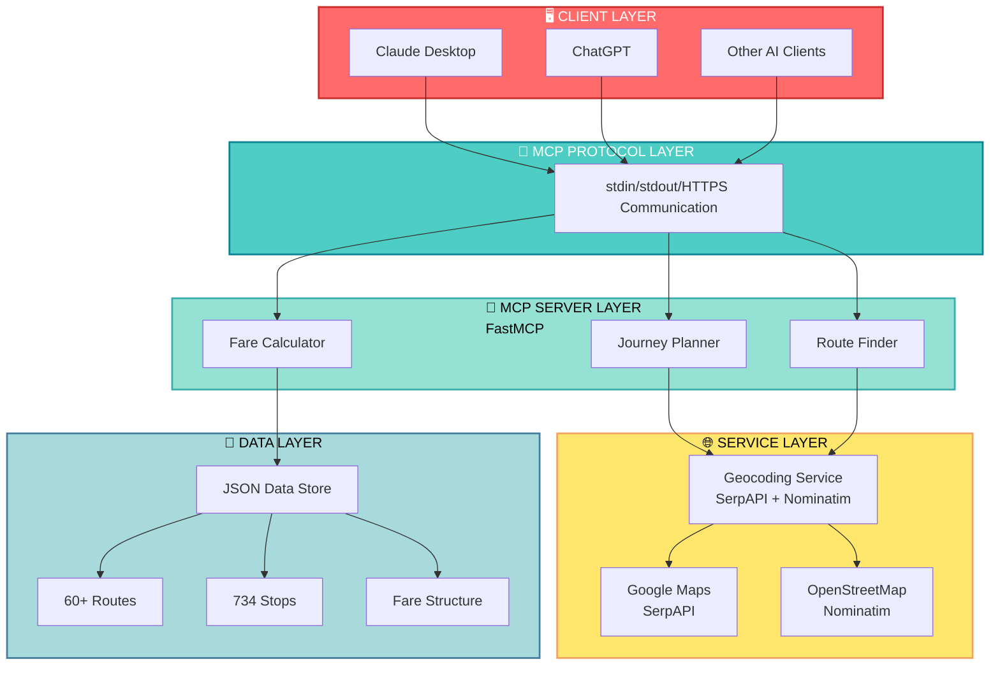
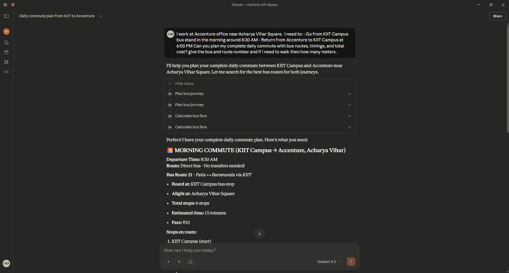
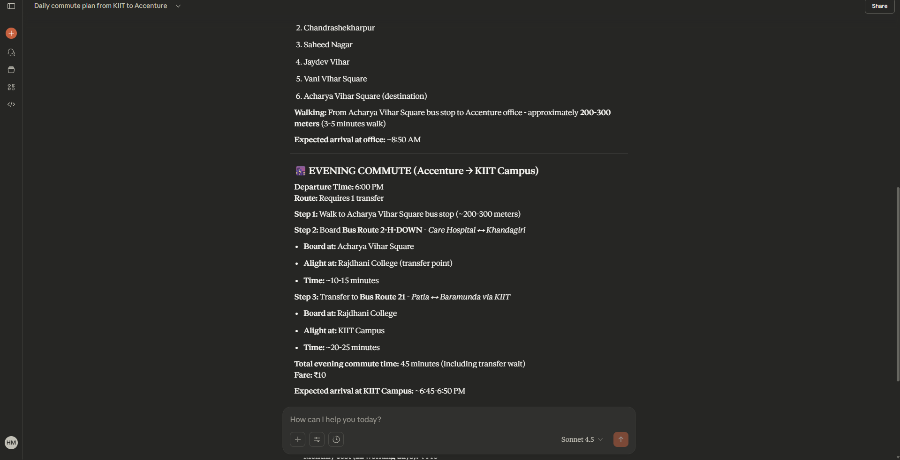

# 🚌 Mo Bus / Ama Bus MCP Server (unofficial)


<div align="center">
  <a href="https://github.com/HimanshuMohanty-Git24/MoBusMCP">
    
    
    
  </a>
</div>

> **Unofficial** AI-Powered Bus Route Planner for Odisha's Capital Region

<div align="center">

[](https://opensource.org/licenses/MIT)
[](https://www.python.org/downloads/)
[](https://github.com/jlowin/fastmcp)
[]()
[](https://github.com/HimanshuMohanty-Git24/MoBusMCP/stargazers)
[](https://github.com/HimanshuMohanty-Git24/MoBusMCP/network/members)
[](https://github.com/HimanshuMohanty-Git24/MoBusMCP/issues)
[](https://github.com/HimanshuMohanty-Git24/MoBusMCP/pulls)

</div>

**A Model Context Protocol (MCP) server that brings intelligent bus route planning to any AI assistant.** Plan your daily commute in Bhubaneswar, Cuttack, and Puri with natural language queries through Claude, ChatGPT, or any MCP-compatible AI.

---

## 📖 Table of Contents

- [Overview](#overview)
- [Features](#features)
- [Official Bus Network Map](#official-bus-network-map)
- [Architecture](#architecture)
- [Installation](#installation)
- [Quick Start](#quick-start)
- [Usage](#usage)
- [Configuration](#configuration)
- [Data Sources](#data-sources)
- [Contributing](#contributing)
- [Collaboration Opportunities](#collaboration-opportunities)
- [Disclaimer](#disclaimer)
- [License](#license)
- [Support](#support)
- [Acknowledgments](#acknowledgments)

---

## 🎯 Overview

### The Problem

As a regular Mo Bus/Ama Bus commuter in Odisha, I faced daily challenges:
- 😕 **Confusion about which bus to take** — Multiple routes, same destination
- 🔍 **Time wasted searching** — Opening the app, finding routes, checking stops
- 🤔 **Uncertainty about boarding points** — Where exactly should I board?
- 📱 **Context switching** — Constantly switching between apps

### The Solution

**Mo Bus MCP Server** solves this by bringing intelligent route planning directly to your AI assistant. Just ask:

> *"I need to go from KIIT Campus to Accenture near Acharya Vihar Square at 8:30 AM. What bus should I take?"*

And get instant, detailed journey plans with:

✅ Exact bus numbers to board  
✅ Walking distances to nearest stops  
✅ Total journey time and fare  
✅ Alternative routes if available  

**Plug-and-play with any LLM** — Claude, ChatGPT, or any MCP-compatible AI assistant.

---

## ✨ Features

### 🚏 Intelligent Journey Planning
- **Natural language queries** — Just ask in plain English
- **Smart geocoding** — Uses Google Maps (SerpAPI) + OpenStreetMap
- **Nearest stop detection** — Automatically finds closest Mo Bus stops
- **Multi-route suggestions** — Get alternatives with pros/cons
- **Walking distance calculation** — Know exactly how far to walk
- **Real-time fare estimation** — Based on distance and route

### 🗺️ Comprehensive Coverage
- **60+ Bus Routes** — Covering major corridors
- **734 Bus Stops** — Across Bhubaneswar, Cuttack, and Puri
- **3 Major Cities** — Capital region connectivity
- **Special Services** — Airport, Railway Station, Hospital routes

### 🤖 AI-Native Design
- **MCP Protocol** — Works with Claude Desktop, ChatGPT, and more
- **FastMCP Framework** — Clean, modern Python implementation
- **Tool-based Architecture** — Modular, extensible design
- **Context-aware** — Understands landmarks, addresses, and colloquial names

### 🔧 Developer-Friendly
- **Well-documented** — Clean code with comprehensive comments
- **Easy to extend** — Modular service architecture
- **Environment-based config** — Simple `.env` setup
- **Comprehensive error handling** — Graceful degradation

---

## 🗺️ Official Bus Network Map

This is the complete stop and route map for the Capital Region Urban Transport (CRUT) network in Odisha:

<div align="center">


**Complete Bus Network: 60+ Routes | 734 Stops | Bhubaneswar • Cuttack • Puri**

</div>

### Map Coverage

- **Primary Network** — All major routes connecting city centers
- **Stop Locations** — Precise geographic locations of all bus stops
- **Route Details** — Color-coded routes for easy identification
- **Connection Points** — Transit hubs and interchange stations
- **Service Areas** — Airport, Railway Station, Hospital, Educational Institutions

For the most up-to-date official information, visit [CRUT Official Website](https://www.capitalregiontransport.in/)

---

## 🏗️ Architecture

### System Design



### Component Breakdown

| Component | Technology | Purpose |
|-----------|-----------|---------|
| **Server Framework** | FastMCP 2.0 | MCP protocol implementation |
| **Geocoding** | SerpAPI + OSM Nominatim | Location to coordinates conversion |
| **Journey Planning** | Custom Algorithm | Route finding and optimization |
| **Data Storage** | JSON | Routes, stops, and fare data |
| **Distance Calculation** | Haversine Formula | Walking distance computation |
| **Language Support** | Python 3.10+ | Core implementation |

### Project Structure

```
AmABUSMCP/
├── src/
│   ├── __init__.py                   # Package initialization
│   ├── server.py                     # FastMCP server entry point
│   ├── data/
│   │   ├── __init__.py              # Data loading and helpers
│   │   └── (data utilities)
│   ├── services/
│   │   ├── __init__.py
│   │   ├── geocoding.py             # SerpAPI + OSM geocoding service
│   │   └── planner.py               # Journey planning algorithms
│   └── utils/
│       ├── __init__.py
│       └── distance.py              # Haversine distance calculations
├── asset/
│   ├── ALL STOP AND ROUT MAP.png    # Official network map
│   ├── homescreen_logo-*.png        # Mo Bus logo
│   ├── crut_logo-*.png              # CRUT logo
│   └── AMA_BUS_ODIA-*.png           # Ama Bus logo
├── mo_bus_complete_database.json    # Complete routes & stops database
├── requirements.txt                  # Python dependencies
├── pyproject.toml                   # Project configuration
├── .env.example                     # Example environment variables
├── .gitignore                       # Git ignore rules
└── README.md                        # This file
```

---

## 🚀 Installation

### Prerequisites

- **Python 3.10** or higher — [Download Python](https://www.python.org/downloads/)
- **pip** or **uv** (recommended for faster installs)
- **SerpAPI Key** (optional, for enhanced geocoding)
- **Git** — For cloning the repository

### Method 1: Using `uv` (Recommended - Fastest)

[uv](https://github.com/astral-sh/uv) is a blazing-fast Python package installer written in Rust.

```bash
# Step 1: Install uv (if not already installed)
curl -LsSf https://astral.sh/uv/install.sh | sh

# Step 2: Clone the repository
git clone https://github.com/HimanshuMohanty-Git24/MoBusMCP.git
cd MoBusMCP

# Step 3: Create virtual environment
uv venv

# Step 4: Activate virtual environment
# On Windows:
.venv\Scripts\activate
# On macOS/Linux:
source .venv/bin/activate

# Step 5: Install dependencies
uv sync
```

### Method 2: Using `pip`

```bash
# Step 1: Clone the repository
git clone https://github.com/HimanshuMohanty-Git24/MoBusMCP.git
cd MoBusMCP

# Step 2: Create virtual environment
python -m venv venv

# Step 3: Activate virtual environment
# On Windows:
venv\Scripts\activate
# On macOS/Linux:
source venv/bin/activate

# Step 4: Install dependencies
pip install -r requirements.txt
```

### Environment Setup

Create a `.env` file in the project root:

```bash
# Optional: For enhanced geocoding with Google Maps
SERPAPI_KEY=your_serpapi_key_here

# Optional: Server configuration
LOG_LEVEL=INFO
DEBUG_MODE=false
```

**Get a free SerpAPI key:**
1. Visit [SerpAPI](https://serpapi.com/)
2. Sign up for a free account (includes free credits)
3. Copy your API key
4. Add it to `.env`

---

## 🎯 Quick Start

### 1. Start the Server (Standalone)

```bash
# Activate virtual environment first
source .venv/bin/activate  # macOS/Linux
# or
.venv\Scripts\activate     # Windows

# Run the server
python -m src.server
```

The server will start listening for MCP client connections.

### 2. Configure with Claude Desktop

1. **Install Claude Desktop** from [Claude.ai](https://claude.ai/download)

2. **Edit Claude Desktop config** file:
   - **Windows:** `%APPDATA%\Claude\claude_desktop_config.json`
   - **macOS:** `~/Library/Application Support/Claude/claude_desktop_config.json`
   - **Linux:** `~/.config/Claude/claude_desktop_config.json`

3. **Add Mo Bus server configuration:**

```json
{
  "mcpServers": {
    "mo-bus": {
      "command": "python",
      "args": ["-m", "src.server"],
      "cwd": "C:\\path\\to\\MoBusMCP",
      "env": {
        "PYTHONPATH": "C:\\path\\to\\MoBusMCP",
        "SERPAPI_KEY": "your_serpapi_key_here"
      }
    }
  }
}
```

4. **Restart Claude Desktop**

5. **Start planning your journeys!**

---

## 🎮 Usage

### Example Queries

Try asking Claude any of these questions:

```
💬 "Show me all bus routes going to the airport"

💬 "I'm at KIIT Campus and need to reach Bhubaneswar Railway Station. 
    What bus should I take?"

💬 "Which buses stop at Master Canteen?"

💬 "Calculate fare from Baramunda to Nandankanan Zoo"

💬 "Plan my morning commute from KIIT to Accenture, Acharya Vihar at 8:30 AM"

💬 "What are all the stops on Route 10?"

💬 "I need to go from Cuttack to Bhubaneswar, what are my options?"

💬 "Find the nearest bus stop near my current location (mention landmark)"
```

### Response Format

Claude will provide structured responses with:

```
📍 Source: [Your starting point]
📍 Destination: [Where you need to go]
🚌 Bus Options: [Available routes with numbers]
🚶 Walking Distance: [To nearest stop]
⏱️ Journey Time: [Estimated duration]
💰 Fare: [Estimated cost]
📅 Alternative Routes: [If available]
```

### Advanced Features

- **Multi-leg journeys** — Automatic connection suggestions
- **Time-based planning** — Consider rush hours and schedules
- **Walking optimization** — Minimize walking distances
- **Fare calculation** — Based on actual routes

---

## 📸 Screenshots of Demo

### Live Demo of the MCP in Action in Claude Desktop

#### 1. Initial Query and Route Planning
<div align="center">
  
</div>

#### 2. Journey Details and Stop Information
<div align="center">
  
</div>

#### 3. Complete Commute Plan with Costs
<div align="center">
  
</div>

---

## 📹 Video Demo

### Full Demo on YouTube

Watch the complete demonstration of Mo Bus MCP Server in action:

<div align="center">
  <a href="https://www.youtube.com/watch?v=5amNjx5qDVE" target="_blank">
    
  </a>
  
  **[Watch Full Demo on YouTube](https://www.youtube.com/watch?v=5amNjx5qDVE)**
</div>

---

## ⚙️ Configuration

### SerpAPI Setup (Optional but Recommended)

SerpAPI provides accurate Google Maps geocoding for better location matching.

**Without SerpAPI:** The system falls back to free OpenStreetMap Nominatim (works but less accurate).

#### Setup Steps:

1. **Sign up** at [SerpAPI](https://serpapi.com/) (free tier available)
2. **Get your API key** from the dashboard
3. **Add to `.env`:**
   ```
   SERPAPI_KEY=your_key_here
   ```
4. **Restart the server**

### Customization

#### Adding New Routes

Edit `mo_bus_complete_database.json`:

```json
{
  "routes": {
    "NEW_ROUTE": {
      "route_number": "NEW_ROUTE",
      "route_name": "Start Point ↔ End Point",
      "start": "Start Location",
      "end": "End Location",
      "via": "Via Points",
      "stops": ["Stop 1", "Stop 2", "Stop 3"],
      "distance_km": 10,
      "service": "Regular"
    }
  }
}
```

#### Adding New Stops

Add coordinates in `src/data/__init__.py`:

```python
coordinate_map = {
    'your_stop_id': {'lat': 20.2961, 'lon': 85.8245},
    'another_stop': {'lat': 20.3000, 'lon': 85.8300},
}
```

#### Environment Variables

```bash
# Server logging level
LOG_LEVEL=INFO|DEBUG|WARNING|ERROR

# Enable debug mode for development
DEBUG_MODE=true|false

# API timeout (seconds)
API_TIMEOUT=30

# Maximum walking distance (km)
MAX_WALKING_DISTANCE=5
```

---

## 📊 Data Sources

### Data Acquisition Process

**⚠️ IMPORTANT DISCLAIMER:** All route and stop data was **manually sourced and compiled** by the developer. The process involved:

#### 1. Source Collection
- Downloaded official route maps from [CRUT Website](https://www.capitalregiontransport.in/)
- Collected route images from Mo Bus/Ama Bus app
- Gathered schedule PDFs from official sources
- Cross-referenced with OpenStreetMap data

#### 2. Data Extraction
- Used Large Language Models (GPT-4, Claude) for image-to-data conversion
- Manually verified and cross-referenced outputs
- Parsed routes in batches over multiple iterations
- Validated against real-world observations

#### 3. Data Consolidation
- Combined all parsed routes into unified JSON format
- Manually added coordinates for major stops using GPS
- Verified route sequences and connection points
- Created comprehensive fare tables

### Data Accuracy & Coverage

**⚠️ Data may contain inaccuracies:**
- Some routes might be outdated (CRUT updates routes regularly)
- Stop names may vary from official sources
- Coordinates might not be pinpoint accurate
- New routes added by CRUT may not be included
- Discontinued routes may still be present

**Current Coverage:**
- ✅ **60+ Routes** (out of 84+ operated by CRUT)
- ✅ **734 Bus Stops**
- ✅ **18 Cities/Areas** in Capital Region
- ⚠️ **~70% Route Coverage**

### Help Improve the Data

We actively need community contributions! If you notice:

- ❌ Incorrect route information
- ❌ Missing bus stops
- ❌ Wrong stop sequences
- ❌ Outdated routes
- ❌ Coordinate inaccuracies

**Please contribute:**

1. **Open an Issue** on [GitHub Issues](https://github.com/HimanshuMohanty-Git24/MoBusMCP/issues) with details
2. **Submit a Pull Request** with corrections
3. **Share accurate data** you have

**Priority needs:**
- 🔴 Real-time bus locations
- 🔴 Live schedule updates
- 🔴 Accurate stop coordinates (GPS)
- 🔴 Missing 44 routes documentation

---

## 🤝 Contributing

Contributions are **highly welcome**! Whether you're a developer, data enthusiast, or bus commuter, there are many ways to contribute.

### Types of Contributions

#### 1. Data Improvements (No coding required!)
- Add missing routes
- Fix incorrect stop sequences
- Add accurate GPS coordinates
- Update route names and details
- Validate existing data

#### 2. Code Enhancements
- Improve geocoding accuracy
- Optimize journey planning algorithm
- Add new features (e.g., real-time tracking)
- Improve error handling
- Optimize performance
- Add unit tests

#### 3. Documentation
- Improve README
- Add code comments and docstrings
- Create tutorial articles
- Translate documentation
- Create video tutorials

#### 4. Integration & Partnerships
- Integrate with other AI platforms
- Build web/mobile interfaces
- Create CLI tools
- Develop mobile apps

### Contribution Process

```bash
# 1. Fork the repository on GitHub
git clone https://github.com/YOUR-USERNAME/MoBusMCP.git
cd MoBusMCP

# 2. Create a feature branch
git checkout -b feature/your-feature-name

# 3. Make your changes
# Edit files, add features, improve data, etc.

# 4. Commit your changes
git add .
git commit -m "Add: description of your changes"

# 5. Push to your fork
git push origin feature/your-feature-name

# 6. Open a Pull Request on GitHub
# Include description of changes and why they're needed
```

### Code Style Guide

- Use **PEP 8** for Python code
- Add **type hints** where possible
- Write **docstrings** for functions
- Add **comments** for complex logic
- Keep functions **small and focused**

### Commit Message Format

```
Type: Brief description (50 chars max)

Optional longer description explaining why the change was made.
Reference issues: #123, #456
```

**Types:** `Add:`, `Fix:`, `Improve:`, `Docs:`, `Refactor:`, `Test:`

---

## 🤝 Collaboration Opportunities

### 🚨 Calling CRUT and Chalo Team!

**To:** [Capital Region Urban Transport (CRUT)](https://www.capitalregiontransport.in/)  
**To:** Chalo App Development Team  
**Project:** [Mo Bus MCP Server](https://github.com/HimanshuMohanty-Git24/MoBusMCP)

Hello! I'm the developer of this **unofficial** Mo Bus MCP server, built out of passion as a regular Mo Bus commuter to solve real commuting problems.

#### What We Have Built

- ✅ **Working AI-powered journey planner** — Natural language interface
- ✅ **Integration with Claude, ChatGPT, and other AI assistants** — Via MCP Protocol
- ✅ **60 routes and 734 stops** — Manually compiled and verified
- ✅ **Smart geocoding** — Using SerpAPI + OpenStreetMap
- ✅ **Modular, extensible architecture** — Easy to enhance

#### What We Could Build Together

- 🚀 **Real-time bus tracking** — Live location integration
- 🚀 **Live schedule updates** — Direct from CRUT systems
- 🚀 **Accurate, official route data** — From your databases
- 🚀 **Payment integration** — Razorpay/UPI for ticket booking via AI
- 🚀 **In-app ticketing** — Directly through Claude/ChatGPT
- 🚀 **Seat availability** — Real-time bus crowding information
- 🚀 **Delay notifications** — Instant alerts and alternatives
- 🚀 **Multi-language support** — Odia, Hindi, English interfaces

#### Why Collaborate?

**For CRUT/Chalo:**
- 📈 **Increase ridership** through AI accessibility
- 💡 **Innovate commute planning** with emerging technology
- 🌟 **Showcase Odisha** as AI-forward public transport leader
- 📉 **Reduce support queries** with intelligent automation
- 🤝 **Build community** of tech-savvy commuters

**For the Community:**
- ✨ **Accurate, real-time journey planning**
- 🎟️ **Seamless ticket booking** through AI
- 📱 **Better commute experience** for all users
- 🚌 **Encourage public transport** adoption
- 🌍 **Sustainable urban mobility** solution

#### Let's Talk!

I'm open to:
- 🤝 Official partnership or MOA
- 🔌 API access for real-time data
- 👨‍💻 Joint development of features
- 📜 Licensing arrangements
- 💼 Whatever works best for everyone!

**Contact:** [Open an Issue](https://github.com/HimanshuMohanty-Git24/MoBusMCP/issues) or reach out via GitHub

---

## ⚠️ Disclaimer

### Unofficial Project

**This is an UNOFFICIAL, COMMUNITY-DRIVEN project** and is NOT affiliated with, endorsed by, or connected to:
- Capital Region Urban Transport (CRUT)
- Government of Odisha
- Chalo App or any of its developers
- Any official Mo Bus/Ama Bus service provider
- Any government transport authority

### Data Accuracy

**NO WARRANTY PROVIDED:** The route, stop, and schedule data in this project:

- May be **incomplete, outdated, or incorrect**
- Was **manually compiled** from publicly available sources
- Has **NOT been officially verified** by authorities
- Should **NOT be the sole source** for journey planning
- May **NOT reflect current operations**

### Always Verify Independently

Before traveling, always verify:
- ✓ Check the **official Mo Bus/Ama Bus app**
- ✓ Confirm routes with **bus conductors**
- ✓ Visit [CRUT Official Website](https://www.capitalregiontransport.in/) for official schedules
- ✓ Check for **service changes or strikes**

### Liability Disclaimer

The developer(s) and maintainers of this project:

- Provide this software **"AS IS"** without warranty of any kind
- Are **NOT responsible** for:
  - Missed buses or transportation delays
  - Incorrect or outdated route information
  - Travel inconveniences or missed appointments
  - Data accuracy issues
  - Service unavailability
- Do **NOT guarantee** data accuracy or service availability
- Are **NOT liable** for any damages arising from use of this software

### Use at Your Own Risk

By using this MCP server, you acknowledge and accept:
- This is an **experimental, community-driven project**
- Data **may be inaccurate or significantly outdated**
- You will **verify important journey information independently**
- You use this tool **entirely at your own risk**
- You **absolve the developers** of any liability

---

## 📄 License

**MIT License** — See [LICENSE](LICENSE) file for complete details.

### In Simple Terms (TL;DR)

✅ **You can:**
- Use this project freely
- Modify and redistribute it
- Use it commercially
- Create derivative works

❌ **You must:**
- Include the original license
- Include copyright notice
- NOT hold us liable

**Bottom line:** Free to use and modify, but use at your own risk! 😊

---

## 📞 Support & Community

### Getting Help

- **Issues & Bugs:** [GitHub Issues](https://github.com/HimanshuMohanty-Git24/MoBusMCP/issues)
- **Discussions:** [GitHub Discussions](https://github.com/HimanshuMohanty-Git24/MoBusMCP/discussions)
- **Documentation:** [This README](#)
- **Email:** [Your contact info]

### Community

- 🌟 **Star the repository** if you find it useful
- 🍴 **Fork and contribute** to improve the project
- 💬 **Share your feedback** and suggestions
- 📣 **Spread the word** to other commuters

---

## 🙏 Acknowledgments & Credits

### Organizations

- **CRUT (Capital Region Urban Transport)** — For operating the Mo Bus/Ama Bus service
- **Government of Odisha** — For public transport infrastructure
- **Chalo App team** — For the original Mo Bus application

### Technologies & Libraries

- **FastMCP** — Excellent MCP framework creators
- **Claude & ChatGPT** — For AI capabilities and data extraction
- **OpenStreetMap** — Free mapping data and Nominatim service
- **SerpAPI** — For Google Maps geocoding integration
- **Haversine Formula** — For accurate distance calculations
---

<div align="center">

## ⭐ If You Find This Useful, Please Star! ⭐

[](https://github.com/HimanshuMohanty-Git24/MoBusMCP/stargazers)

Your stars help the project reach more people and encourage further development!

### Repository Stats


### Follow & Connect

- 🐙 **GitHub:** [HimanshuMohanty-Git24](https://github.com/HimanshuMohanty-Git24)
- 📧 **Issues:** [Report & Discuss](https://github.com/HimanshuMohanty-Git24/MoBusMCP/issues)

---

Made with ❤️ for Mo Bus commuters in Odisha

*Because commuting should be intelligent, not stressful.*

---

</div>

